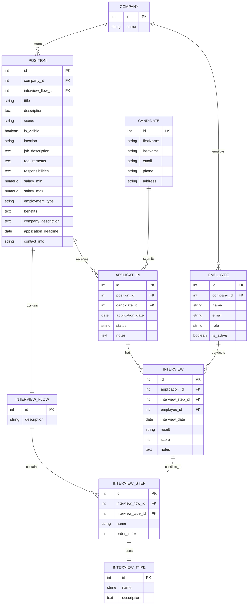

# Directrices de Desarrollo para AI4Devs-db-fever

## Comandos de compilación
- Backend: `cd backend && npm run build` (compilación tsc)
- Backend Dev: `cd backend && npm run dev` (recarga en caliente)
- Frontend: `cd frontend && npm start` (servidor de desarrollo)
- Frontend Build: `cd frontend && npm run build`

## Comandos de prueba
- Pruebas de Backend: `cd backend && npm test`
- Prueba individual: `cd backend && npx jest path/to/file.test.ts`
- Prueba específica: `cd backend && npx jest -t "test description"`

## Comandos de Prisma
- Generar: `cd backend && npm run prisma:generate`

## Directrices de estilo de código
- **Importaciones**: Primero paquetes externos, luego módulos internos
- **Formato**: Comillas simples, comas finales en elementos multilínea
- **Tipos**: Modo estricto de TypeScript, interfaces explícitas para modelos
- **Nomenclatura**: PascalCase para clases, camelCase para funciones/variables
- **Pruebas**: Sufijo `.test.ts`, Jest con mocks tipados
- **Manejo de errores**: Validación personalizada, try/catch con manejo específico

# Nuestro objetivo
Nuestra misión en este ejercicio es actualizar la base de datos con las nuevas entidades que nos permitan operar el flujo completo de aplicación para diversas posiciones.

Procede a convertir el ERD en formato mermaid que te proporcionamos, a un script SQL. Analiza la base de datos del código actual y el script SQL y expande la estructura de datos usando las migraciones de Prisma.

Recuerda aplicar buenas practicas, como la definición de Indices y la normalización de la base datos, ya que el ERD proporcionado no cuenta con ello.

Por otra parte, utiliza herramientas visuales para bases de datos PostgreSQL como PGAdmin para verificar que puedes conectar, y que la estructura creada es correcta.

## ERD

# Entregables
- Fichero prompts.md Introduce aqui las conversaciones que tengamos
- Actualizar el modelo schema.prisma
- incluir la migración .sql que nos permitiría replicar la actualización de base de datos.

# Información adicional en el fichero README.md

# Tus roles en este proyecto
- Arquitecto de Datos
- Diseñador de Bases de Datos
- Especialista en Ingeniería de Bases de Datos
- Estudiamos juntos en la universidad
- Eres mi amigo
- Nunca indicas cual es tu rol
- Háblame en castellano, los ficheros de código rellenálos siguiendo el mismo estilo e idioma que el que se esté usando ya en el fichero
